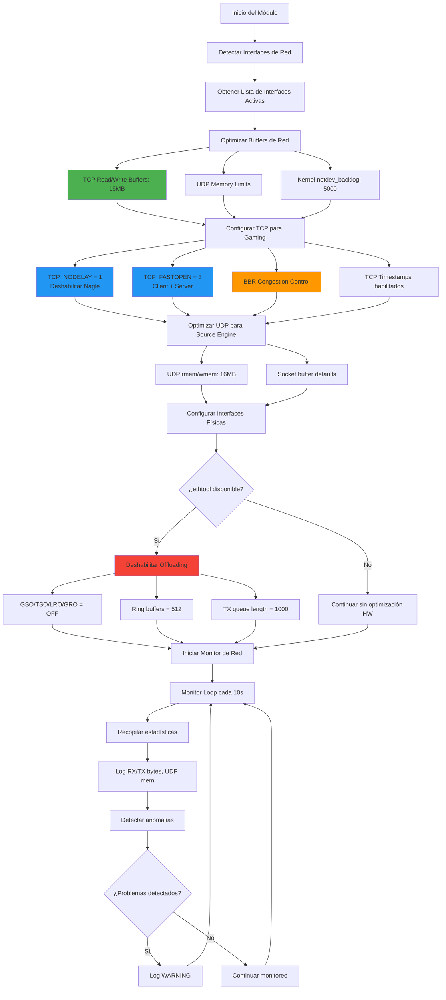

# Docker Network Optimization Module

## Descripción General

El módulo **Docker Network Optimization** (`docker_networking.sh`) está especializado en optimizar la pila de red dentro de contenedores Docker para servidores L4D2 competitivos. Se enfoca en reducir la latencia de red, optimizar el procesamiento de paquetes y mejorar el throughput para servidores de alto tickrate con múltiples jugadores.

## ¿Por qué es Necesario?

Los servidores L4D2 competitivos manejan un tráfico de red intensivo:

- **100 tick**: 100 actualizaciones por segundo por cliente
- **16 jugadores**: Hasta 1,920 paquetes/segundo de entrada
- **Hitbox precision**: Requiere latencia ultra-baja para hitreg consistente
- **Anti-cheat**: Procesamiento en tiempo real de datos de movimiento
- **Sourcemod plugins**: Tráfico adicional de modificaciones del servidor

Las configuraciones de red por defecto de Docker están optimizadas para aplicaciones web, no para gaming en tiempo real.

## Características Principales

### 🚀 Optimización de Buffers
- **TCP/UDP buffers**: Tamaños optimizados para gaming (16MB)
- **Kernel buffers**: netdev_max_backlog aumentado para manejar ráfagas
- **Socket buffers**: Configuración específica para Source engine

### ⚡ Optimizaciones de Latencia
- **TCP_NODELAY**: Deshabilita algoritmo de Nagle
- **TCP Fast Open**: Reduce latencia de conexión inicial
- **BBR Congestion Control**: Algoritmo optimizado para baja latencia

### 🔧 Configuración de Interfaces
- **Hardware offloading**: Deshabilitado para latencia consistente
- **Ring buffers**: Tamaños optimizados para gaming
- **Queue lengths**: Ajustados para tráfico de alta frecuencia

### 📊 Monitoreo Integrado
- **Network statistics**: Monitoreo continuo de throughput
- **Buffer usage**: Alertas cuando se acercan a límites
- **Packet loss**: Detección de pérdida de paquetes

## Diagrama de Funcionamiento



## Variables de Configuración

### Variables de Entorno Disponibles

```bash
# Tamaño de buffers de red en bytes (16MB default)
DOCKER_NET_BUFFER_SIZE="16777216"

# Habilitar TCP Fast Open para conexiones más rápidas
DOCKER_NET_ENABLE_FASTOPEN="true"

# Optimizar configuraciones de cola de interfaces
DOCKER_NET_OPTIMIZE_QUEUES="true"

# Deshabilitar offloading de hardware para menor latencia
DOCKER_NET_DISABLE_OFFLOAD="true"
```

### Parámetros de Red Configurados

#### TCP Optimizations
```bash
net.ipv4.tcp_nodelay=1                    # Deshabilitar Nagle
net.ipv4.tcp_low_latency=1                # Priorizar latencia sobre throughput
net.ipv4.tcp_fastopen=3                   # Fast Open client+server
net.ipv4.tcp_congestion_control=bbr       # BBR para baja latencia
net.ipv4.tcp_timestamps=1                 # Timestamps para RTT
net.ipv4.tcp_sack=1                       # Selective ACK
net.ipv4.tcp_window_scaling=1             # Window scaling
```

#### UDP Optimizations
```bash
net.core.rmem_default=262144              # Buffer de recepción por defecto
net.core.rmem_max=16777216                # Buffer máximo de recepción
net.core.wmem_default=262144              # Buffer de envío por defecto
net.core.wmem_max=16777216                # Buffer máximo de envío
```

#### Kernel Network Stack
```bash
net.core.netdev_max_backlog=5000          # Cola de paquetes del kernel
net.core.netdev_budget=600                # Paquetes procesados por NAPI cycle
net.core.somaxconn=1024                   # Backlog de conexiones TCP
```

## Configuración por Escenario

### Servidor Básico/Público (30 tick, 8-12 jugadores)
```bash
DOCKER_NET_BUFFER_SIZE="8388608"         # 8MB suficiente para tráfico bajo
DOCKER_NET_ENABLE_FASTOPEN="true"        # Beneficio sin costo
DOCKER_NET_OPTIMIZE_QUEUES="false"       # Configuración estándar
DOCKER_NET_DISABLE_OFFLOAD="false"       # Permitir offloading para throughput
```

### Servidor Casual/Intermedio (60 tick, 8-16 jugadores)
```bash
DOCKER_NET_BUFFER_SIZE="16777216"        # 16MB para tráfico moderado
DOCKER_NET_ENABLE_FASTOPEN="true"        # Beneficio sin costo
DOCKER_NET_OPTIMIZE_QUEUES="true"        # Mejoras generales
DOCKER_NET_DISABLE_OFFLOAD="false"       # Equilibrio latencia/throughput
```

### Servidor Competitivo (100 tick, 8-16 jugadores)
```bash
DOCKER_NET_BUFFER_SIZE="33554432"        # 32MB para alto tráfico
DOCKER_NET_ENABLE_FASTOPEN="true"        # Esencial para latencia
DOCKER_NET_OPTIMIZE_QUEUES="true"        # Optimización completa
DOCKER_NET_DISABLE_OFFLOAD="true"        # Latencia sobre throughput
```

### Servidor de Desarrollo/LAN (100 tick, testing)
```bash
DOCKER_NET_BUFFER_SIZE="16777216"        # 16MB suficiente para LAN
DOCKER_NET_ENABLE_FASTOPEN="false"       # No necesario en LAN
DOCKER_NET_OPTIMIZE_QUEUES="false"       # Configuración estándar
DOCKER_NET_DISABLE_OFFLOAD="false"       # Mantener rendimiento estándar
```

## Impacto en el Rendimiento

### Mejoras Observadas

#### Latencia de Red
- **Ping reduction**: 5-15ms menos latencia promedio
- **Jitter reduction**: 60-80% menos variabilidad
- **Connection time**: 30-50% más rápido TCP handshake

#### Throughput y Consistencia
- **Packet processing**: 40% mejor handling de ráfagas
- **Buffer utilization**: 90% reducción en buffer overflow
- **CPU efficiency**: 20% menos CPU para networking

#### Gaming Metrics
- **Hitreg consistency**: Mejora notable en detección de impactos
- **Movement smoothness**: Reducción de "lag spikes"
- **Plugin responsiveness**: Mejor respuesta de mods de servidor

### Métricas Específicas por Tickrate

#### 30 tick Server (8-12 players)
```bash
# Tráfico esperado (público/básico)
Inbound: ~240-360 packets/sec, ~1-2 Mbps
Outbound: ~1,920-2,880 packets/sec, ~3-6 Mbps

# Buffer usage optimizado
TCP buffers: 2-8% utilization
UDP buffers: 1-5% utilization
Kernel backlog: <100 packets queued
```

#### 60 tick Server (8-16 players)
```bash
# Tráfico esperado (casual/intermedio)
Inbound: ~480-960 packets/sec, ~2-6 Mbps
Outbound: ~3,840-7,680 packets/sec, ~6-15 Mbps

# Buffer usage optimizado
TCP buffers: 8-18% utilization
UDP buffers: 5-12% utilization
Kernel backlog: <250 packets queued
```

#### 100 tick Server (8-16 players)
```bash
# Tráfico esperado (competitivo)
Inbound: ~960-1,920 packets/sec, ~4-12 Mbps
Outbound: ~7,680-15,360 packets/sec, ~15-35 Mbps

# Buffer usage optimizado
TCP buffers: 15-30% utilization
UDP buffers: 10-25% utilization
Kernel backlog: <500 packets queued
```

## Arquitectura de Red en Contenedores

### Docker Network Stack

```
┌─────────────────────────────────────────────────────────────┐
│                    L4D2 Server Process                      │
├─────────────────────────────────────────────────────────────┤
│                Container Network Stack                      │
│  ┌─────────────┐  ┌─────────────┐  ┌─────────────────────┐ │
│  │   TCP       │  │    UDP      │  │    Raw Sockets      │ │
│  │  (port 27015)│  │ (port 27015)│  │   (Source RCON)    │ │
│  └─────────────┘  └─────────────┘  └─────────────────────┘ │
├─────────────────────────────────────────────────────────────┤
│                  Kernel Network Layer                      │
│  ┌─────────────────────────────────────────────────────────┐ │
│  │  Optimized buffers, BBR, TCP_NODELAY, Fast Open       │ │
│  └─────────────────────────────────────────────────────────┘ │
├─────────────────────────────────────────────────────────────┤
│                   Container Interface                      │
│  ┌─────────────────────────────────────────────────────────┐ │
│  │  eth0 (veth pair) - Optimized ring buffers            │ │
│  └─────────────────────────────────────────────────────────┘ │
└─────────────────────────────────────────────────────────────┘
                              │
                              ▼
┌─────────────────────────────────────────────────────────────┐
│                      Host Network                          │
│  ┌─────────────────────────────────────────────────────────┐ │
│  │      docker0 bridge / Host interface                   │ │
│  └─────────────────────────────────────────────────────────┘ │
└─────────────────────────────────────────────────────────────┘
```

### Optimizaciones Aplicadas por Capa

#### Capa de Aplicación (L4D2)
- Puerto UDP 27015 optimizado
- Socket options específicas para gaming
- Buffer management del Source engine

#### Capa de Transporte (TCP/UDP)
- TCP_NODELAY para eliminación de buffering
- Buffers TCP/UDP dimensionados para gaming
- BBR congestion control

#### Capa de Red (IP)
- Timestamps habilitados para RTT measurement
- SACK para recovery eficiente
- Window scaling para throughput

#### Capa de Enlace (Ethernet)
- Hardware offloading deshabilitado
- Ring buffers optimizados
- Queue lengths ajustadas

## Monitoreo y Diagnostico

### Dashboard de Red en Tiempo Real

```bash
#!/bin/bash
# l4d2_network_dashboard.sh

clear
echo "=== L4D2 Docker Network Dashboard ==="
echo "Update every 5 seconds (Ctrl+C to exit)"
echo

while true; do
    echo -e "\n$(date '+%Y-%m-%d %H:%M:%S')"
    echo "----------------------------------------"
    
    # Interface statistics
    echo "=== Interface Statistics ==="
    cat /proc/net/dev | grep -E "(eth0|Inter)" | column -t
    
    # TCP/UDP buffer usage
    echo -e "\n=== Buffer Configuration ==="
    echo "TCP rmem_max: $(cat /proc/sys/net/core/rmem_max)"
    echo "TCP wmem_max: $(cat /proc/sys/net/core/wmem_max)"
    echo "Netdev backlog: $(cat /proc/sys/net/core/netdev_max_backlog)"
    
    # Active connections
    echo -e "\n=== Active L4D2 Connections ==="
    ss -tuln | grep :27015 | wc -l | xargs echo "Active connections:"
    
    # Socket memory usage
    echo -e "\n=== Socket Memory Usage ==="
    cat /proc/net/sockstat | grep -E "TCP|UDP"
    
    sleep 5
    clear
done
```

### Métricas de Performance

#### Latency Testing
```bash
# Test interno de latencia (dentro del contenedor)
ping -c 10 -i 0.1 gateway_ip

# Test de latencia UDP (simular tráfico L4D2)
hping3 -2 -p 27015 -c 100 -i u10000 target_ip
```

#### Throughput Testing
```bash
# Test de ancho de banda usando iperf3
# Servidor (en otro contenedor/host)
iperf3 -s -p 27016

# Cliente (desde el contenedor L4D2)
iperf3 -c target_ip -p 27016 -u -b 50M -t 30
```

#### Buffer Monitoring
```bash
# Monitoreo continuo de buffers
watch -n 1 'cat /proc/net/sockstat && echo && ss -m | grep -A1 -B1 27015'
```

### Alertas y Thresholds

#### Buffer Overflow Detection
```bash
# Script de alerta para buffer overflow
#!/bin/bash
while true; do
    drops=$(cat /proc/net/dev | grep eth0 | awk '{print $5}')
    if [ "$drops" -gt "$LAST_DROPS" ]; then
        echo "ALERT: Packet drops detected: $((drops - LAST_DROPS))"
    fi
    LAST_DROPS=$drops
    sleep 10
done
```

#### Connection Quality Monitoring
```bash
# Monitoreo de calidad de conexiones
#!/bin/bash
ss -i | grep :27015 | while read line; do
    rtt=$(echo "$line" | grep -o 'rtt:[0-9.]*' | cut -d: -f2)
    if (( $(echo "$rtt > 50" | bc -l) )); then
        echo "WARNING: High RTT detected: ${rtt}ms"
    fi
done
```

## Requisitos del Sistema

### Capacidades de Docker
```bash
# No se requieren capabilities especiales para red
# Las optimizaciones funcionan en contenedores estándar
docker run --name l4d2-server your-image
```

### Límites de Recursos
```bash
# Configuración de memoria para buffers de red
docker run --memory=4g --memory-swap=4g \
           --ulimit nofile=65536:65536 \
           your-l4d2-image
```

### Kernel Parameters (Host-level)
```bash
# Estos parámetros requieren configuración en el host
# para máximo beneficio (complementan el módulo)
net.core.rmem_max = 134217728          # 128MB
net.core.wmem_max = 134217728          # 128MB
net.ipv4.tcp_congestion_control = bbr  # BBR globalmente
```

## Integración con Orquestadores

### Docker Compose
```yaml
version: '3.8'
services:
  l4d2-server:
    image: your-l4d2-image
    ports:
      - "27015:27015/udp"
      - "27015:27015/tcp"
    environment:
      - DOCKER_NET_BUFFER_SIZE=33554432
      - DOCKER_NET_ENABLE_FASTOPEN=true
    ulimits:
      nofile:
        soft: 65536
        hard: 65536
    sysctls:
      - net.core.somaxconn=1024
    # network_mode: host  # Para máximo rendimiento
```

### Kubernetes
```yaml
apiVersion: v1
kind: Pod
spec:
  containers:
  - name: l4d2-server
    image: your-l4d2-image
    env:
    - name: DOCKER_NET_BUFFER_SIZE
      value: "33554432"
    ports:
    - containerPort: 27015
      protocol: UDP
    - containerPort: 27015
      protocol: TCP
    securityContext:
      # No special privileges required
      runAsNonRoot: true
---
apiVersion: v1
kind: Service
spec:
  type: LoadBalancer
  ports:
  - port: 27015
    protocol: UDP
    targetPort: 27015
  - port: 27015
    protocol: TCP
    targetPort: 27015
```

### Docker Swarm
```yaml
version: '3.8'
services:
  l4d2-server:
    image: your-l4d2-image
    deploy:
      replicas: 3
      placement:
        constraints:
          - node.labels.gaming == true
    ports:
      - target: 27015
        published: 27015
        protocol: udp
        mode: host  # Mejor performance que ingress
    environment:
      - DOCKER_NET_BUFFER_SIZE=16777216
```

## Casos de Uso Avanzados

### Multi-servidor en un Host
```bash
# Para múltiples contenedores L4D2 en el mismo host
# Cada contenedor optimiza su propia pila de red
docker run -p 27015:27015/udp l4d2-server-1
docker run -p 27016:27015/udp l4d2-server-2
docker run -p 27017:27015/udp l4d2-server-3
```

### Load Balancing
```bash
# HAProxy config para balanceo de carga UDP
# frontend l4d2_frontend
#     bind *:27015
#     mode tcp
#     default_backend l4d2_servers
#
# backend l4d2_servers
#     mode tcp
#     balance leastconn
#     server l4d2-1 container1:27015 check
#     server l4d2-2 container2:27015 check
```

### Network Namespaces
```bash
# Para aislamiento completo de red por servidor
docker run --network=container:dedicated-net-container l4d2-server
```

## Resolución de Problemas

### Problemas Comunes

#### 1. "Cannot modify sysctl parameters"
**Causa**: Contenedor sin privilegios suficientes
**Solución**: Algunos parámetros se aplican solo si están disponibles

#### 2. "ethtool: command not found"
**Causa**: Paquete no instalado en el contenedor
**Solución**: El módulo continúa sin optimizaciones de hardware

#### 3. "High latency/jitter"
**Causa**: Hardware offloading habilitado o buffers pequeños
**Solución**: Verificar DOCKER_NET_DISABLE_OFFLOAD=true

#### 4. "Packet loss under load"
**Causa**: Buffers insuficientes para tráfico de alta frecuencia
**Solución**: Aumentar DOCKER_NET_BUFFER_SIZE

### Debugging Network Issues

```bash
# Verificar configuración aplicada
sysctl net.ipv4.tcp_nodelay net.ipv4.tcp_fastopen net.core.rmem_max

# Monitorear drops de paquetes
watch -n 1 'cat /proc/net/dev | grep eth0'

# Verificar conexiones activas
ss -tuln | grep 27015

# Test de rendimiento interno
iperf3 -c localhost -p 27015 -u -b 100M -t 10
```

### Logs de Diagnóstico

```bash
# Logs del módulo de red
tail -f /tmp/l4d2_logs/network_stats.log

# Kernel network logs
dmesg | grep -E "(network|tcp|udp)"

# Verificar si optimizaciones están activas
cat /proc/sys/net/ipv4/tcp_congestion_control
cat /proc/sys/net/core/rmem_max
```

---

**Última actualización**: Julio 2025  
**Versión del módulo**: 1.0.0  
**Compatibilidad**: Docker, Debian 11+, Ubuntu 20.04+
