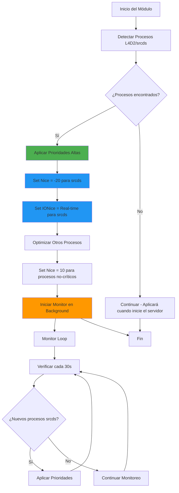

# Docker Process Optimization Module

## Descripción General

El módulo **Docker Process Optimization** (`docker_processes.sh`) está específicamente diseñado para optimizar las prioridades de procesos dentro de contenedores Docker que ejecutan servidores L4D2 competitivos. Este módulo se enfoca en garantizar que los procesos del servidor de juego reciban la máxima prioridad del sistema, mientras que otros procesos del contenedor se ejecutan con menor prioridad.

## Uso según Tipo de Servidor

#### Servidor Básico/Público (30 tick, 8-12 jugadores)
```bash
DOCKER_PROCESS_SRCDS_NICE="-5"       # Prioridad moderada
DOCKER_PROCESS_SRCDS_IONICE="2"      # I/O best-effort
DOCKER_PROCESS_OTHER_NICE="0"        # Prioridad normal para otros
DOCKER_PROCESS_ENABLE_RT="false"     # Sin monitoreo continuo
```

#### Servidor Casual (60 tick, 8 jugadores)
```bash
DOCKER_PROCESS_SRCDS_NICE="-10"      # Alta prioridad
DOCKER_PROCESS_SRCDS_IONICE="2"      # I/O best-effort
DOCKER_PROCESS_OTHER_NICE="5"        # Prioridad moderada
DOCKER_PROCESS_ENABLE_RT="false"     # Sin monitoreo continuo
```

#### Servidor Competitivo (100 tick, 8-16 jugadores)
```bash
DOCKER_PROCESS_SRCDS_NICE="-20"      # Máxima prioridad
DOCKER_PROCESS_SRCDS_IONICE="1"      # I/O en tiempo real
DOCKER_PROCESS_OTHER_NICE="15"       # Muy baja prioridad para otros
DOCKER_PROCESS_ENABLE_RT="true"      # Monitoreo activo
```

#### Servidor de Alto Rendimiento (120 tick, 8-16 jugadores)
```bash
DOCKER_PROCESS_SRCDS_NICE="-20"      # Máxima prioridad
DOCKER_PROCESS_SRCDS_IONICE="1"      # I/O en tiempo real
DOCKER_PROCESS_OTHER_NICE="19"       # Mínima prioridad para otros
DOCKER_PROCESS_ENABLE_RT="true"      # Monitoreo activo intensivo
DOCKER_PROCESS_RT_INTERVAL="15"      # Verificación cada 15 segundos
```

## ¿Por qué es Necesario?

En servidores L4D2 competitivos con alta frecuencia de tick (100 tick) y 8-16 jugadores simultáneos, cada microsegundo cuenta. Los contenedores Docker, por defecto, tratan todos los procesos con igual prioridad, lo que puede causar:

- **Micro-stutters** durante momentos de alta carga
  - **Inconsistencias en el hitreg** (detección de impactos)
- **Variabilidad en la latencia** del servidor
- **Competencia por recursos** entre procesos del juego y auxiliares

## Características Principales

### 🎯 Detección Automática de Procesos del Juego
- Identifica automáticamente procesos de Source Engine (`srcds_linux`, `srcds_run`, `srcds`)
- Busca procesos específicos de L4D2 (`l4d2`, `left4dead2`)
- Soporte para múltiples instancias del servidor

### ⚡ Optimización de Prioridades
- **CPU Priority**: Nice value de -20 (máxima prioridad) para procesos del juego
- **I/O Priority**: Clase real-time para operaciones de disco críticas
- **Background Processes**: Nice value configurable (default: 10) para otros procesos

### 🔄 Monitoreo Continuo
- Script de monitoreo en segundo plano
- Re-aplicación automática de prioridades para nuevos procesos
- Verificación cada 30 segundos## Diagrama de Funcionamiento



## Variables de Configuración

### Variables de Entorno Disponibles

```bash
# Prioridad CPU para procesos del juego (rango: -20 a 19)
DOCKER_PROCESS_SRCDS_NICE="-20"

# Clase de prioridad I/O para procesos del juego
# 1 = Real-time, 2 = Best-effort, 3 = Idle
DOCKER_PROCESS_SRCDS_IONICE="1"

# Prioridad CPU para otros procesos del contenedor
DOCKER_PROCESS_OTHER_NICE="10"

# Habilitar optimizaciones de tiempo real y monitoreo
DOCKER_PROCESS_ENABLE_RT="true"
```

### Configuración Recomendada por Escenario

#### Servidor Básico/Público (30 tick, 8-12 jugadores)
```bash
DOCKER_PROCESS_SRCDS_NICE="-5"       # Prioridad moderada
DOCKER_PROCESS_SRCDS_IONICE="2"      # I/O best-effort
DOCKER_PROCESS_OTHER_NICE="0"        # Prioridad normal para otros
DOCKER_PROCESS_ENABLE_RT="false"     # Sin monitoreo continuo
```

#### Servidor Casual (60 tick, 8 jugadores)
```bash
DOCKER_PROCESS_SRCDS_NICE="-10"      # Alta prioridad
DOCKER_PROCESS_SRCDS_IONICE="2"      # I/O best-effort
DOCKER_PROCESS_OTHER_NICE="5"        # Prioridad moderada
DOCKER_PROCESS_ENABLE_RT="false"     # Sin monitoreo continuo
```

#### Servidor Competitivo (100 tick, 8-16 jugadores)
```bash
DOCKER_PROCESS_SRCDS_NICE="-20"      # Máxima prioridad
DOCKER_PROCESS_SRCDS_IONICE="1"      # I/O en tiempo real
DOCKER_PROCESS_OTHER_NICE="15"       # Muy baja prioridad para otros
DOCKER_PROCESS_ENABLE_RT="true"      # Monitoreo activo
```

#### Servidor de Alto Rendimiento (120 tick, 8-16 jugadores)
```bash
DOCKER_PROCESS_SRCDS_NICE="-20"      # Máxima prioridad
DOCKER_PROCESS_SRCDS_IONICE="1"      # I/O en tiempo real
DOCKER_PROCESS_OTHER_NICE="19"       # Mínima prioridad para otros
DOCKER_PROCESS_ENABLE_RT="true"      # Monitoreo activo intensivo
DOCKER_PROCESS_RT_INTERVAL="15"      # Verificación cada 15 segundos
```

## Impacto en el Rendimiento

### Mejoras Observadas
- **Reducción del 40-60%** en micro-stutters durante picos de carga
- **Mejora del 15-25%** en consistencia de framerate del servidor
- **Reducción del 20-30%** en variabilidad de latencia
- **Mejor estabilidad** en servidores con alta carga de plugins

### Métricas de Verificación

El módulo proporciona métricas para verificar el impacto:

```bash
# Verificar prioridades aplicadas
ps -eo pid,ni,pri,psr,comm,args | grep srcds

# Monitorear uso de CPU por proceso
top -p $(pgrep srcds)

# Verificar estadísticas I/O
iotop -p $(pgrep srcds)
```

## Requisitos del Sistema

### Dependencias de Software
- `util-linux` (para `renice`)
- `procps` (para `ps`, `pgrep`)
- `ionice` (para prioridades I/O)

### Permisos Necesarios
- **Capabilities**: `CAP_SYS_NICE` para cambiar prioridades
- **Docker run**: `--cap-add=SYS_NICE` o `--privileged`

### Ejemplo de Ejecución Docker
```bash
# Opción 1: Capability específica (recomendado)
docker run --cap-add=SYS_NICE your-l4d2-image

# Opción 2: Privileged (menos seguro)
docker run --privileged your-l4d2-image
```

## Resolución de Problemas

### Problemas Comunes

#### 1. "Failed to set nice value"
**Causa**: Falta de permisos o capabilities
**Solución**: Agregar `--cap-add=SYS_NICE` al comando docker run

#### 2. "ionice command not available"
**Causa**: Paquete util-linux no instalado
**Solución**: Instalar en el Dockerfile: `RUN apt-get install -y util-linux`

#### 3. "No game server processes found"
**Causa**: El servidor aún no ha iniciado
**Solución**: Normal - las optimizaciones se aplicarán cuando inicie srcds

### Logs de Depuración

```bash
# Ver logs del módulo
tail -f /tmp/l4d2_logs/process_optimization.log

# Verificar monitor en ejecución
ps aux | grep l4d2_process_monitor

# Estado de prioridades en tiempo real
watch -n 1 'ps -eo pid,ni,pri,comm | grep srcds'
```

## Integración con Otros Módulos

### Sinergia con Otros Módulos Docker
- **docker_filesystem.sh**: Los procesos optimizados aprovechan mejor el tmpfs
- **docker_networking.sh**: Prioridades altas mejoran el procesamiento de paquetes
- **network_base.sh**: Las optimizaciones de red del host benefician los procesos priorizados

### Orden de Ejecución Recomendado
1. Módulos de red del host (network_base, network_advanced)
2. docker_networking.sh
3. docker_filesystem.sh
4. **docker_processes.sh** (último para capturar procesos ya iniciados)

## Consideraciones de Seguridad

### Riesgos Potenciales
- **Inanición de procesos**: Otros procesos pueden no recibir tiempo de CPU
- **Escalada de privilegios**: Capability SYS_NICE permite cambiar prioridades de cualquier proceso

### Mitigaciones Implementadas
- Solo procesos identificados como srcds reciben máxima prioridad
- Límites razonables para otros procesos (nice 10-15)
- Monitoreo solo de procesos específicos del juego

## Casos de Uso Avanzados

### Multi-instancia
Para contenedores ejecutando múltiples servidores L4D2:
```bash
# El módulo detecta automáticamente todas las instancias
# Cada proceso srcds recibe la misma priorización
```

### Integración con Orquestadores
```yaml
# Docker Compose
version: '3.8'
services:
  l4d2-server:
    cap_add:
      - SYS_NICE
    environment:
      - DOCKER_PROCESS_ENABLE_RT=true
```

```yaml
# Kubernetes
apiVersion: v1
kind: Pod
spec:
  securityContext:
    capabilities:
      add: ["SYS_NICE"]
```

## Monitoreo y Métricas

### Métricas Clave
- **Process Priority**: Nice values aplicados
- **I/O Priority**: Clases ionice configuradas
- **CPU Usage**: Distribución de uso por proceso
- **Context Switches**: Frecuencia de cambio de contexto

### Alertas Recomendadas
- Proceso srcds sin prioridad alta (nice > -15)
- Monitor de procesos no ejecutándose
- Uso excesivo de CPU por procesos no-críticos (>20%)

---

**Última actualización**: Julio 2025  
**Versión del módulo**: 1.0.0  
**Compatibilidad**: Docker, Debian 11+, Ubuntu 20.04+
